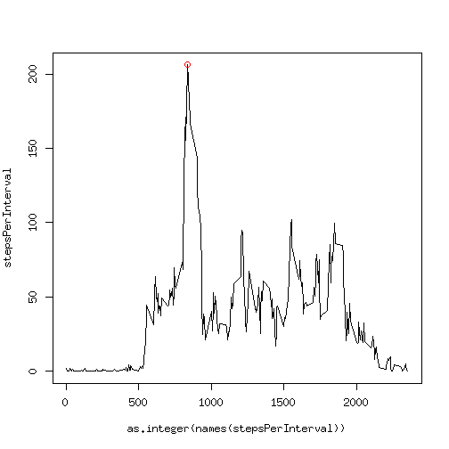

## Loading and preprocessing the data


```r
activity <- read.csv("activity.csv");
summary(activity);
```

```
##      steps                date          interval     
##  Min.   :  0.00   2012-10-01:  288   Min.   :   0.0  
##  1st Qu.:  0.00   2012-10-02:  288   1st Qu.: 588.8  
##  Median :  0.00   2012-10-03:  288   Median :1177.5  
##  Mean   : 37.38   2012-10-04:  288   Mean   :1177.5  
##  3rd Qu.: 12.00   2012-10-05:  288   3rd Qu.:1766.2  
##  Max.   :806.00   2012-10-06:  288   Max.   :2355.0  
##  NA's   :2304     (Other)   :15840
```

```r
activityDaily <- data.frame(
  steps = tapply(activity$steps, activity$date, function(s) { return(sum(s, na.rm = TRUE)); }),
  numNAs = tapply(activity$steps, activity$date, function(s) { return(sum(is.na(s))); }));
```

## What is mean total number of steps taken per day?


```r
dailyStepsHistogram <- function(activity)
{
  stepsPerDay <- tapply(activity$steps, activity$date, function(s) { return(sum(s, na.rm = TRUE)); });
  meanStepsPerDay <- mean(stepsPerDay);
  medianStepsPerDay <- median(stepsPerDay);
  hist(stepsPerDay, main = "number of steps per day");
  rug(stepsPerDay);
  abline(v = meanStepsPerDay, col = "blue");
  abline(v = medianStepsPerDay, col = "green");
  legend("topright", legend = c("mean", "median"), col = c("blue", "green"), lwd = 1);
  return(invisible(list(stepsPerDay = stepsPerDay, meanStepsPerDay = meanStepsPerDay, medianStepsPerDay = medianStepsPerDay)));
}
dailyStats <- dailyStepsHistogram(activity);
```

 

Measurements were recorded during 61 days.
The mean total number of steps is 9354.2295082,
the median is 10395.


## What is the average daily activity pattern?


```r
intervalStepsPlot <- function(activity, ...)
{
  stepsPerInterval <- tapply(activity$steps, activity$interval, function(s) { return(mean(s, na.rm = TRUE)); });
  stepsPerInterval <- stepsPerInterval[order(as.integer(names(stepsPerInterval)))];
  maxStepsPerInterval <- max(stepsPerInterval);
  argmaxStepsPerInterval <- names(stepsPerInterval)[which(stepsPerInterval == maxStepsPerInterval)];
  plot(as.integer(names(stepsPerInterval)), stepsPerInterval, type = "l", ...);
  points(as.integer(argmaxStepsPerInterval), maxStepsPerInterval, col = "red");
  return(invisible(list(stepsPerInterval = stepsPerInterval, maxStepsPerInterval = maxStepsPerInterval, argmaxStepsPerInterval = argmaxStepsPerInterval)));
}
intervalStepsStats <- intervalStepsPlot(activity);
```

 

The largest average number of steps in an interval is
206.1698113 and occurs in interval
835.
The plot below shows the average number of
steps as a function of the time interval, with the maximum highlighted
by a red circle.


## Imputing missing values


```r
apply(activity, 2, function(x) { return(sum(is.na(x))); });
```

```
##    steps     date interval 
##     2304        0        0
```

The above summary shows that there are only missing values (numbering
2304) in the `steps` column, the `date` and
`interval` columns (which presumably are independent variables) are
complete.

The following code sets up `activityImputed` as a data frame in which
the missing values are "filled in" by the mean activity in that
interval (taken from the `stepsPerInterval` object created
previously).


```r
indexStepsNA <- which(is.na(activity$steps));
stepsImputed <- activity$steps;
stepsImputed[indexStepsNA] <- stepsPerInterval[as.character(activity$interval[indexStepsNA])];
activityImputed <- activity;
activityImputed$steps <- stepsImputed;
```

Using the previously `dailyStepsHistogram` function, the histogram and stats are as follows:

```r
dailyStatsImputed <- dailyStepsHistogram(activityImputed);
```

 

After this imputation, 
the mean total number of steps is 1.0766189 &times; 10<sup>4</sup>,
the median is 1.0766189 &times; 10<sup>4</sup>
(or here's the same with controlling the number formatting using `sprintf`,
the mean total number of steps is   10766.1886792,
the median is   10766.1886792).

So the mean has gone up, and the median is now the same as the mean. A
possible explanation for the increased mean is that values are more
likely to be missing when few steps are taken, e.g. the monitoring
device may be more likely to be switched off at times of low activity.
After setting a considerable number of values to the mean of the
non-missing values, it is not surprising that the median takes that
value as well, so the median is not really useful after this
imputation anymore.

## Are there differences in activity patterns between weekdays and weekends?

The following plots series of mean number of steps, separated by workday and weekend days.


```r
dayCat <- as.factor(ifelse(weekdays(as.Date(activity$date)) %in% c("Saturday", "Sunday"), "weekend", "workday"));
activityByDayCat <- by(activity, dayCat, function(x) { return(x); });
par(mfrow = c(2, 1));
intervalStepsPlot(activityByDayCat$workday, main = "workday", ylim = c(0, 250));
intervalStepsPlot(activityByDayCat$weekend, main = "weekday", ylim = c(0, 250));
```

 

My first impression is that there's a more concentrated spike of
activity on workday mornings, followed by lower levels of activity
during the rest of the day (perhaps due to working in an office / at a
computer), while the peak of activity occurs later during weekends
(very sensibly having a lie-in?) and higher activity levels throughout
the day.
